 
Installation & Usage
============

Prerequisites
-------------

Loyae currently supports the WordPress CMS. If you are using a different CMS, please contact us at contact@loyae.com

Installing Loyae on WordPress
------------------------------
Search for "Loyae" in the WordPress plugin directory under the "plugins" tab.

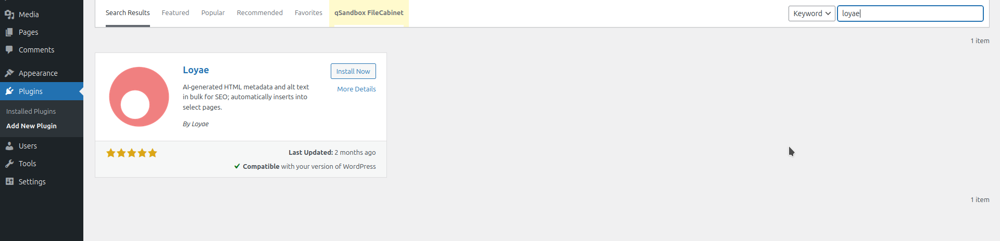

.. raw:: html

     

Click "install," then click "activate."

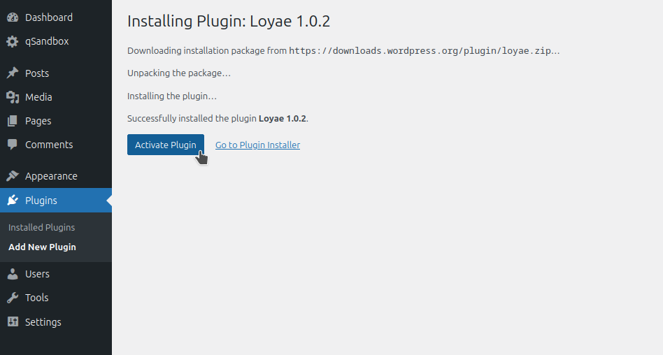

.. raw:: html

     

Once it is activated, click on "Loyae" on the bottom center panel.

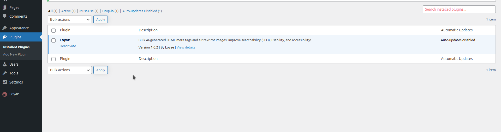

.. raw:: html

     

Diagnose
-------------

Once you are on the Loyae dashboard, click the diagnose button.

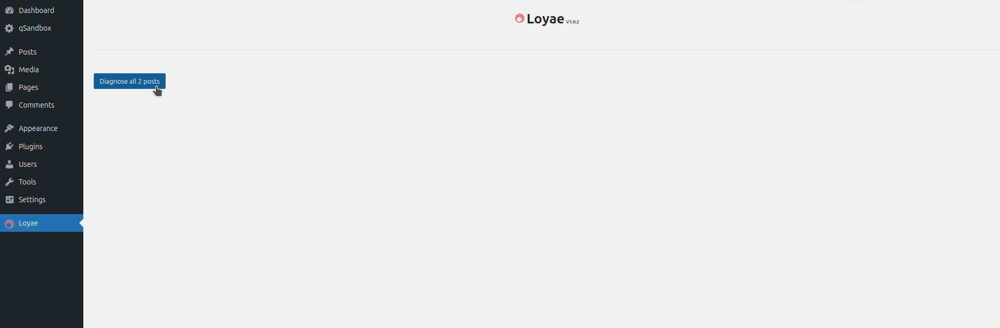

.. raw:: html

     

This will take some time to load as all the pages are scanned.

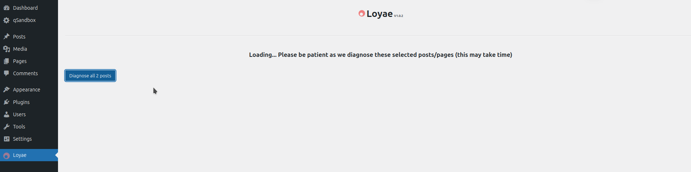

.. raw:: html

     

This will generate a table of all your posts and pages.

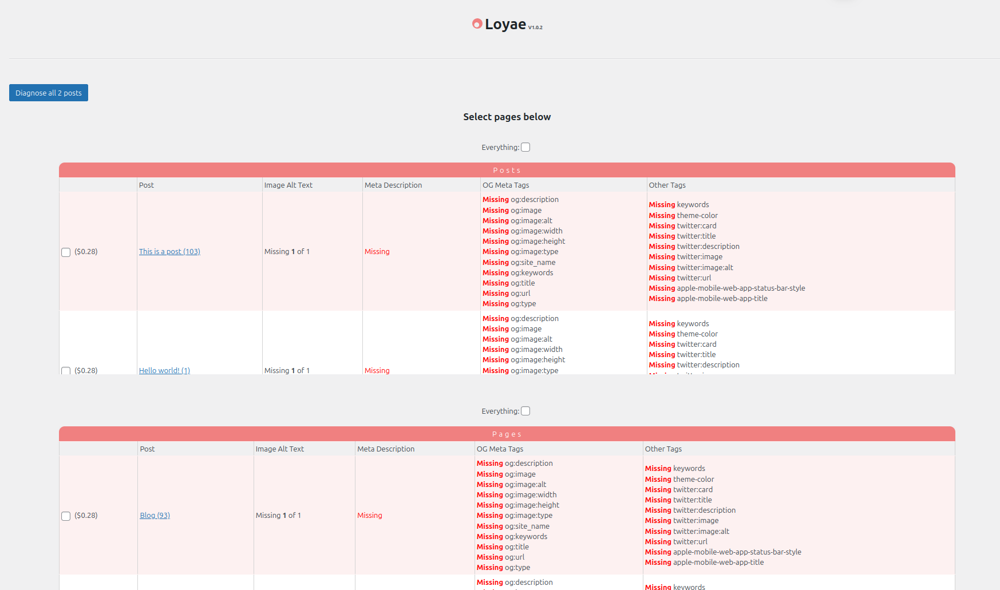

.. raw:: html

     

Select the posts/pages you want to optimize.

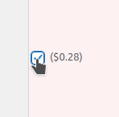

.. raw:: html

     

If you would like, you may select all of them.

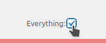

.. raw:: html

     

Fund Account
-------------

Before you can optimize these posts/pages, you must add the necessary funds to your account. Click "Add funds," this will open a new page.

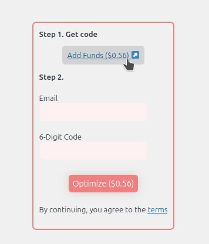

.. raw:: html

     

Enter your email, name, and credit card information to fund your account

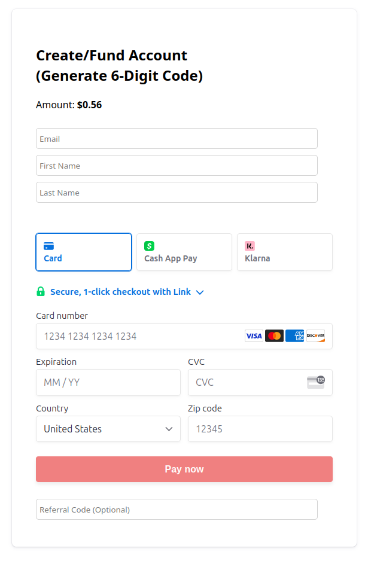

.. raw:: html

     

When you click "Pay now," you will be shown a page that gives you a 6-digit code. Please copy this code. You may now return to the plugin dashboard.

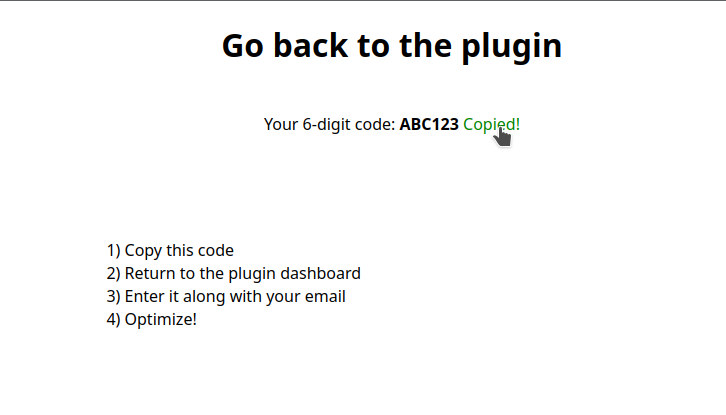

.. raw:: html

     

Optimize
-------------

Once you are back on the dashboard, enter your email and the 6-digit code. You may now click "Optimize."

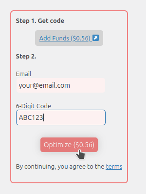

.. raw:: html

     

Note that this may take a very long time. DO NOT LEAVE THE PAGE!

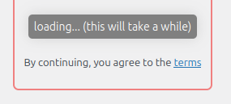

.. raw:: html

     

When the optimization is complete, you will see this page. You are done now!

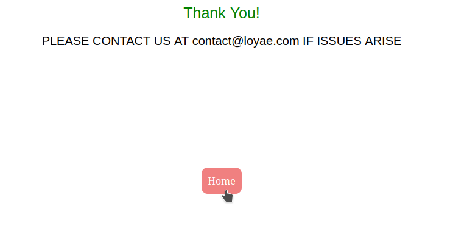

.. raw:: html

     

Example of generated alt text:

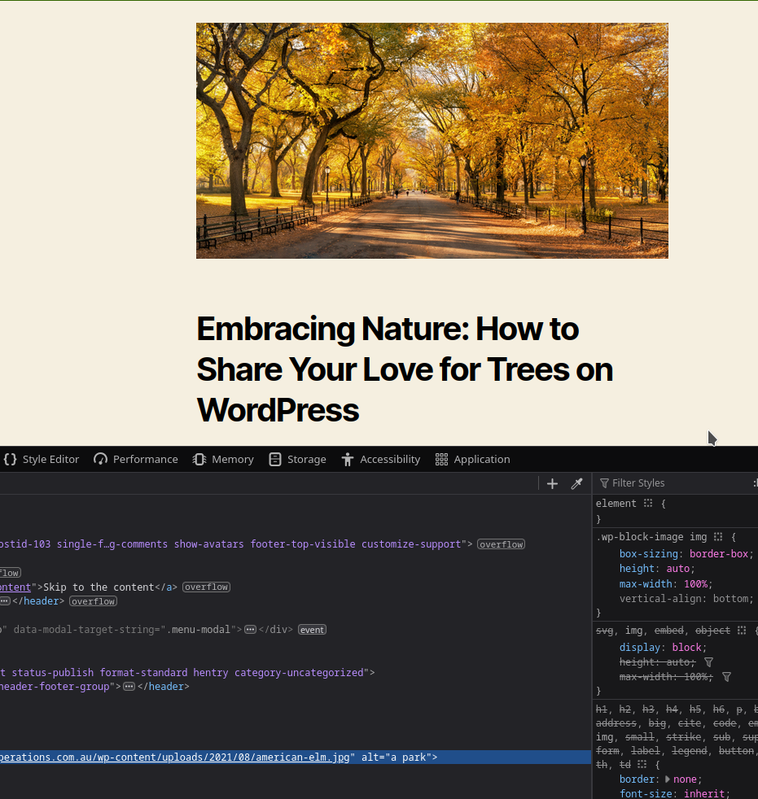

.. raw:: html

     

Example of metadata:

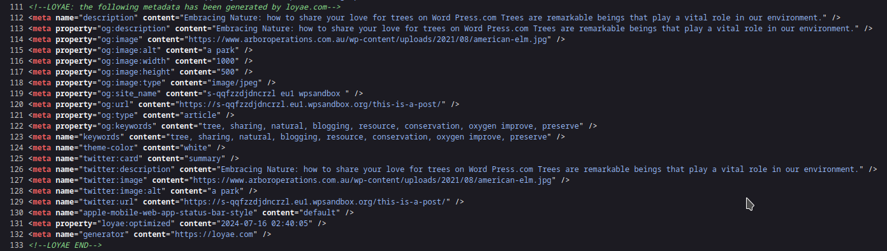

